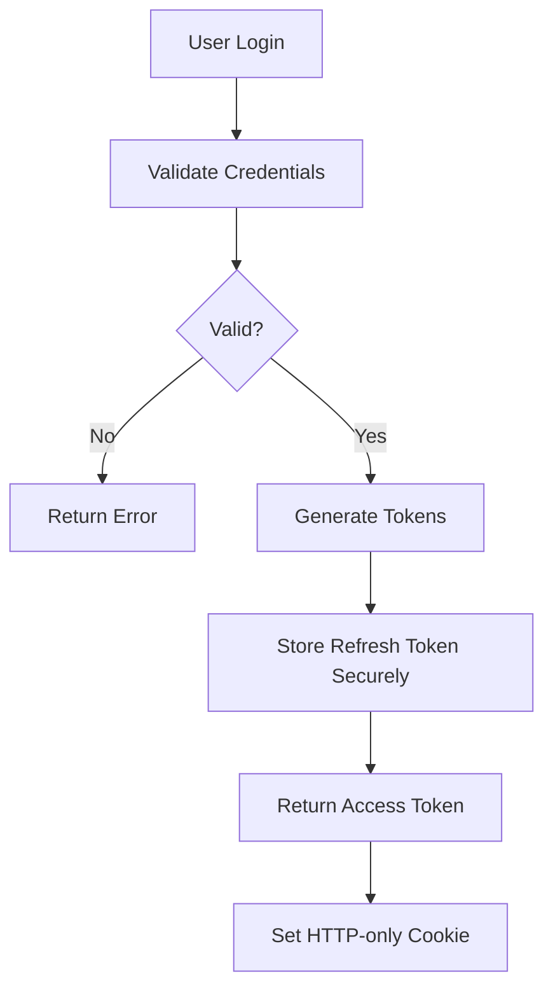

# Security Guide for Todo Chatbot Deployment

This document outlines security best practices for deploying and securing the Todo Chatbot application with Kafka and Dapr.

## Security Principles

The Todo Chatbot follows these security principles:
- **Defense in Depth**: Multiple layers of security controls
- **Least Privilege**: Services and users have minimal necessary permissions
- **Zero Trust**: Verify all requests regardless of source
- **Security by Default**: Secure configurations are the default
- **Privacy by Design**: Protect user data from the ground up

## Authentication & Authorization

### JWT-Based Authentication
- Use RS256 algorithm for signing (asymmetric keys)
- Short-lived access tokens (30 minutes)
- Longer-lived refresh tokens (7 days)
- Token rotation for refresh tokens
- Secure token storage (HTTP-only cookies or secure local storage)

### User Authentication Flow


### Role-Based Access Control (RBAC)
- **User Role**: Access to own tasks and data
- **Admin Role**: Full system access (if applicable)
- **Service Role**: Limited API access for internal services
- Permissions are validated on each request

### API Security Implementation
```python
from fastapi import Depends, HTTPException, status
from fastapi.security import HTTPBearer
from jose import JWTError, jwt
from typing import Optional

security = HTTPBearer()

async def get_current_user(token: str = Depends(security)) -> dict:
    """Get current user from JWT token."""
    credentials_exception = HTTPException(
        status_code=status.HTTP_401_UNAUTHORIZED,
        detail="Could not validate credentials",
        headers={"WWW-Authenticate": "Bearer"},
    )
    try:
        payload = jwt.decode(
            token.credentials,
            settings.secret_key,
            algorithms=[settings.algorithm]
        )
        user_id: str = payload.get("sub")
        if user_id is None:
            raise credentials_exception
        return {"user_id": user_id}
    except JWTError:
        raise credentials_exception

async def get_current_active_user(current_user: dict = Depends(get_current_user)):
    """Verify user is active and authorized."""
    # Check if user is active, not suspended, etc.
    if not await user_service.is_active(current_user["user_id"]):
        raise HTTPException(
            status_code=status.HTTP_401_UNAUTHORIZED,
            detail="Inactive user"
        )
    return current_user
```

## Dapr Security Features

### Service-to-Service Authentication
- **mTLS**: Automatic mutual TLS between Dapr services
- **Service Principals**: Identity for services
- **Trust Domains**: Define trusted service boundaries

### Dapr Configuration Security
```yaml
# components/secretstore.yaml
apiVersion: dapr.io/v1alpha1
kind: Component
metadata:
  name: secure-secret-store
spec:
  type: secretstores.kubernetes
  version: v1
  metadata:
  - name: disableSecretStore
    value: "false"
```

### Access Control with Dapr
```yaml
# components/access-control-policy.yaml
apiVersion: dapr.io/v1alpha1
kind: Configuration
metadata:
  name: appconfig
spec:
  accessControl:
    defaultAction: allow
    trustDomain: "todo-chatbot"
    policies:
    - appId: "todo-api"
      defaultAction: allow
      rules:
      - name: allow_internal_calls
        verbs: ["*"]
        resources: ["*"]
        subjects: [{"user": "dapr:todo-api"}]
```

## Data Protection

### Encryption at Rest
- Database encryption (AES-256)
- File storage encryption
- Backup encryption
- Encrypted environment variables

### Encryption in Transit
- HTTPS for all API communications
- mTLS for service-to-service communication
- SSL/TLS for database connections
- Encrypted Kafka transport

### Database Security
```python
# Use encrypted database connections
DATABASE_URL = f"postgresql://{user}:{password}@{host}:{port}/{database}?sslmode=require"
```

### Data Classification
- **Public**: Non-sensitive, publicly visible data
- **Internal**: Internal application data
- **Confidential**: User personal data
- **Restricted**: Authentication credentials, tokens

## Kafka Security

### Authentication & Authorization
- **SASL/SCRAM**: Secure authentication for Kafka
- **ACLs**: Access control lists for topics
- **Encryption**: TLS encryption for all communications

### Kafka Configuration Security
```yaml
# Dapr Kafka component with security
apiVersion: dapr.io/v1alpha1
kind: Component
metadata:
  name: kafka-pubsub
spec:
  type: pubsub.kafka
  version: v1
  metadata:
  - name: brokers
    value: "secure-kafka.example.com:9093"  # TLS port
  - name: authRequired
    value: "true"
  - name: saslUsername
    secretKeyRef:
      name: kafka-username
      key: username
  - name: saslPassword
    secretKeyRef:
      name: kafka-password
      key: password
  - name: saslMechanism
    value: "SCRAM-SHA-256"
  - name: tlsEnable
    value: "true"
```

## API Security

### Input Validation
- Use Pydantic models for request validation
- Sanitize all user inputs
- Validate content types and sizes
- Implement rate limiting

### Rate Limiting
```python
from slowapi import Limiter, _rate_limit_exceeded_handler
from slowapi.util import get_remote_address

limiter = Limiter(key_func=get_remote_address)

@app.get("/api/v1/tasks")
@limiter.limit("100/minute")
async def get_tasks(current_user: dict = Depends(get_current_active_user)):
    # API implementation
    pass
```

### CORS Configuration
```python
from fastapi.middleware.cors import CORSMiddleware

app.add_middleware(
    CORSMiddleware,
    allow_origins=settings.allowed_origins,  # Don't use ["*"] in production
    allow_credentials=True,
    allow_methods=["*"],
    allow_headers=["*"],
)
```

### Security Headers
```python
from starlette.middleware import Middleware
from starlette.middleware.security import SecurityMiddleware

app.add_middleware(SecurityMiddleware)
```

## Container Security

### Docker Security
- Use non-root user in containers
- Scan images for vulnerabilities
- Use minimal base images (Alpine)
- Run containers with minimal privileges

### Dockerfile Security Example
```dockerfile
# Use official Python runtime as parent image
FROM python:3.11-slim

# Create non-root user
RUN adduser --disabled-password --gecos '' appuser

# Set working directory
WORKDIR /app

# Copy requirements first (better caching)
COPY requirements.txt .

# Install system dependencies securely
RUN apt-get update && \
    apt-get install -y --no-install-recommends \
        postgresql-client \
        && rm -rf /var/lib/apt/lists/*

# Install Python dependencies
RUN pip install --no-cache-dir -r requirements.txt

# Copy application code
COPY . .

# Switch to non-root user
RUN chown -R appuser:appuser /app
USER appuser

# Expose port
EXPOSE 8000

# Run application
CMD ["uvicorn", "main:app", "--host", "0.0.0.0", "--port", "8000"]
```

## Kubernetes Security

### RBAC Configuration
```yaml
# Service account for the application
apiVersion: v1
kind: ServiceAccount
metadata:
  name: todo-chatbot-service-account
  namespace: todo-chatbot

---
# Role with minimal necessary permissions
apiVersion: rbac.authorization.k8s.io/v1
kind: Role
metadata:
  namespace: todo-chatbot
  name: todo-chatbot-role
rules:
- apiGroups: [""]
  resources: ["pods", "services"]
  verbs: ["get", "list"]

---
# Role binding
apiVersion: rbac.authorization.k8s.io/v1
kind: RoleBinding
metadata:
  name: todo-chatbot-rolebinding
  namespace: todo-chatbot
subjects:
- kind: ServiceAccount
  name: todo-chatbot-service-account
  namespace: todo-chatbot
roleRef:
  kind: Role
  name: todo-chatbot-role
  apiGroup: rbac.authorization.k8s.io
```

### Network Policies
```yaml
apiVersion: networking.k8s.io/v1
kind: NetworkPolicy
metadata:
  name: todo-chatbot-network-policy
spec:
  podSelector:
    matchLabels:
      app: todo-chatbot
  policyTypes:
  - Ingress
  - Egress
  ingress:
  - from:
    - namespaceSelector:
        matchLabels:
          name: ingress-nginx
    ports:
    - protocol: TCP
      port: 8000
  egress:
  - to: []  # Allow all egress traffic (customize as needed)
    ports:
    - protocol: TCP
      port: 5432  # PostgreSQL
    - protocol: TCP
      port: 9092  # Kafka
```

## Secrets Management

### Dapr Secrets Management
```python
import httpx

async def get_secret(secret_store: str, key: str) -> str:
    """Retrieve secret from Dapr secret store."""
    async with httpx.AsyncClient() as client:
        response = await client.get(
            f"http://localhost:3500/v1.0/secrets/{secret_store}/{key}"
        )
        return response.json()[key]

# Usage example
db_password = await get_secret("kubernetes-secrets", "db-password")
```

### Environment Variables Security
- Never commit secrets to version control
- Use environment variables for configuration
- Use Dapr secret stores for sensitive data
- Encrypt configuration files

## Monitoring and Logging Security

### Secure Logging
- Don't log sensitive data (passwords, tokens, PII)
- Mask sensitive fields in logs
- Use structured logging
- Encrypt log storage

### Audit Logging
- Log all authentication attempts
- Log authorization failures
- Log data access and modifications
- Log security-related events

## Security Testing

### Vulnerability Scanning
- Scan dependencies for known vulnerabilities
- Use tools like `safety` and `pip-audit`
- Regular security assessments
- Penetration testing

### Security Testing Tools
```bash
# Dependency vulnerability scanning
pip-audit
safety check

# Code security scanning
bandit -r src/

# Container security scanning
docker scan <image-name>
```

## Incident Response

### Security Monitoring
- Monitor authentication failures
- Alert on unusual access patterns
- Track security-related metrics
- Log and analyze security events

### Breach Response Steps
1. **Contain**: Isolate affected systems
2. **Assess**: Determine scope and impact
3. **Notify**: Inform stakeholders as required
4. **Remediate**: Fix vulnerabilities
5. **Review**: Analyze incident and improve processes

## Compliance

### GDPR Compliance
- Data minimization
- Right to erasure
- Consent management
- Data portability

### Data Retention
- Define retention periods
- Implement automatic deletion
- Secure data disposal
- Regular data audits

## Security Checklist

### Pre-Deployment
- [ ] All secrets are stored securely
- [ ] SSL/TLS is configured
- [ ] Authentication is implemented
- [ ] Authorization is validated
- [ ] Rate limiting is configured
- [ ] CORS is properly configured
- [ ] Input validation is in place
- [ ] Security headers are set
- [ ] Vulnerability scans passed
- [ ] Security tests are passing

### Post-Deployment
- [ ] Monitor authentication logs
- [ ] Check for unauthorized access attempts
- [ ] Verify encryption is working
- [ ] Test backup restoration procedures
- [ ] Validate disaster recovery plans
- [ ] Conduct security audit

## Security Resources

### Tools
- **OWASP ZAP**: Web application security scanner
- **Bandit**: Python security linter
- **Safety**: Python dependency checker
- **Docker Bench**: Docker security scanner
- **Kube-Bench**: Kubernetes security scanner

### References
- [OWASP Top 10](https://owasp.org/www-project-top-ten/)
- [Dapr Security Guide](https://docs.dapr.io/concepts/security/)
- [Kubernetes Security Guide](https://kubernetes.io/docs/tasks/administer-cluster/securing-a-cluster/)

This security guide should be reviewed regularly and updated as new threats emerge or as the application evolves.